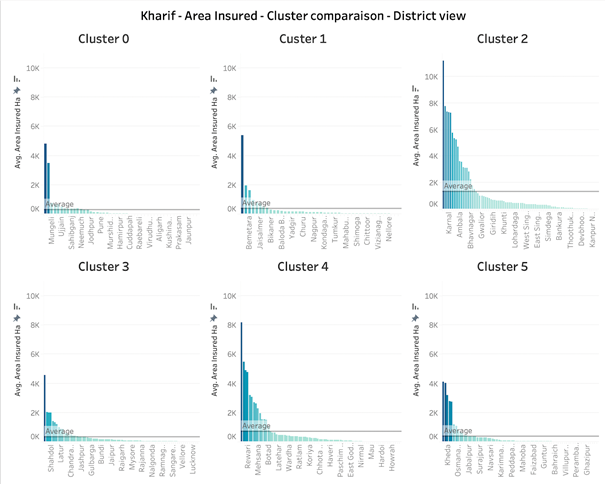

<font size="7"> SCOR CHALLENGE repository 2021 group 8</font><br><br>

**This repository's aim is to contribute to the 2021-2022 SCOR challenge competition** <br><br>

> The main objective of this project is to classify Indian geographical regions according to their agriculatual characteristics using data provided in the _/data_ folder. This data is a combination of data provided by SCOR and external public datasets. Several classification models will be applied, minimizing the Davies-Bouldin index, in order to provide the best results possible and derive insights and conclusions that will help SCOR improve their services in India.
> <br>

<font size="6"> Table of contents</font>

-  [Introduction to the topic](#introduction-to-the-topic)
-  [The data](#the-data)
   -  [The data provided by SCOR](#the-data-provided-by-scor)
   -  [External datasets](#external-datasets)
      -  [VDSA Dataset](#vdsa-dataset)
      -  [Satelite images dataset](#satelite-images-dataset)
-  [Models](#models)
   -  [Presentation of the models](#presentation-of-the-models)
   -  [Incorporation of external datasets to the models](#incorporation-of-external-datasets-to-the-models)
      -  [Matching datasets](#matching-datasets)
      -  [Integrate datasets to the model](#integrate-datasets-to-the-model)
-  [Results](#results)
-  [Openings (ordered by increasing difficulty in our opinion)](#openings-ordered-by-increasing-difficulty-in-our-opinion)
-  [The repository](#the-repository)
   -  [Structure](#structure)
      -  [Datasets](#datasets)
      -  [Material](#material)
      -  [Notebooks](#notebooks)
      -  [Pre_trained models](#pre_trained-models)
      -  [Utile](#utile)
      -  [03_Predictions](#03_predictions)
-  [Usefull commands:](#usefull-commands)
   -  [Build the container<br>](#build-the-container)
   -  [Up containers<br>](#up-containers)
   -  [Stop containers<br>](#stop-containers)
   -  [Open a shell inside the main container<br>](#open-a-shell-inside-the-main-container)
   -  [Run jupyter lab from the container<br>](#run-jupyter-lab-from-the-container)
   -  [The first time you want to use the database, run this from the main container<br>](#the-first-time-you-want-to-use-the-database-run-this-from-the-main-container)
   -  [Connect to the database container<br>](#connect-to-the-database-container)
   -  [Connect to the database inside the container<br>](#connect-to-the-database-inside-the-container)
   -  [Use the database with the data<br>](#use-the-database-with-the-data)
-  [References](#references)

# Introduction to the topic

> The goal of this datathon is to build a better loss prediction classification model using agricultural and geogrpahical characteristics, based off SCOR's historical crop records and other external data sources, in addition to understanding the climate challenges faced by the Indian agricultural sector. <br>
> We were tasked to build a clustering model *“segmenting Indian agricultural zones highlighting similar factors and behaviors for losses” t*o predict crop yield losses in the face of climate change, agricultural trends, and natural disasters.<br><br>
> In Indian crop insurance, the area approach is used, meaning that instead of individual farmers, a specific area is insured. The area can vary in term of size: gram panchayat (an administrative unit containing 8-10 villages) or block or district, but also in terms off crop sown. The claim is calculated on the basis of crop cutting experiments carried out by agricultural departments of respective states. Any shortfall in yield compared to past 5 years average yield is potentially compensated by an insurer and counts as a yield loss.

# The data

## The data provided by SCOR

> The dataset records crop yields through several years for a given location, and also some other information concerning agriculture fields and location. The data of this dataset is summarized in the following table.
> | Feature | Type | Nb of categories (if applicable) |Remarks|Description|
> | --------|:----:|:--------------------------------:|:-----:|:---------:|
> | State | str | 16 ||Refers to Indian state or union territory. India has 28 states and 8 union territories. Not all territories are part of the insured program.|
> | Cluster | int | 13 |The Cluster number is according to the State. There can be a Cluster n°3 in Bihar State but also in West Bengal State.|Clusters are a subdivision of each State, as part of the insurance scheme. Each Indian State defines its own “clusters”. Clusters are not in general official administrative divisions of India.|
> | District | str | 501 | Each district belongs to only one cluster |An administrative division of an Indian state (or territory). Each **cluster** (as defined above) contains several districts; one district belongs to only cluster (within a state).|
> | Sub_District | str | 7227 ||A further (administrative) subdivision of districts. Some districts are divided into sub-districts, other in blocks (see below).|
> | Block | str | 14181 ||A further (administrative) subdivision of districts, more “granular” than sub-divisions. Also called Tehsils or Talukas, they can be seen as a conglomerate of villages.|
> | GP | str | 142312 |A lot of values and a lot of missing values.|Gram Panchayat, or “village”. This is the most granular administrative division in India.|
> | Season | str | 3 ||There are 2 main seasons in India (Kharif and Rabi). In some southern states, there are even 3 seasons (Kharif, Rabi and “summer”)|
> | Crop | str | 98 ||The collected crop. Some crops are only grown in Kharif, other in Rabi.|
> | Area_Sown_Ha | float | ||Area sown by the designated crop. This value is most often provided at district level. If repeated, this level can be at a higher / lower level.|
> | Area_Insured_Ha | float | |[min,max]=[0, 8.53e4]|Area covered by insurance scheme. This value is most often provided at district level. If repeated, this level can be at a higher / lower level.|
> | SI_Per_Ha_Inr_Ha | float | |[min,max]=[1400, 25e4]|Insured value per Ha in Indian Rupee.|
> | Sum_Insured_Inr | float | |[min,max]=[1400, 25e4]|Area Insured \* SI per Ha|
> | Indemnity_Level | float | |[min,max]=[0.7, 90]|Threshold of indemnity level used in the **loss formula**.|
> | 20XX Yield | float | ||Yield harvested at a given year. The yields are often measured with a lag of 2-3 years, but the values that are obtained in the past 7 years will be used in the loss formula for a given year. In some cases, the yields will be provided at (average) district level, while in other cases, it can be given at a more granular division

## External datasets

> &nbsp;&nbsp;&nbsp;&nbsp;In order to understand which additional data could be relevant for our analysis we decided to perform a literature review of important papers describing the factors that have the most significance impact on agricultural output, with a focus on Indian agriculture.<br><br>
> The literature review allowed us to identify a list of economic, operational, institutional, structural and motivational factors that have been shown to have a statistically significant impact on agricultural output. The elements of this lists were ranked based on relevance.
> <br><br>
> These factors include fertilizer usage, rainfall, soil moisture, development expenditure (e.g. government spending on agricultural research and infrastructure), as well as demographic data.
> <br><br>
> After extensive discussion and analysis, we decided to integrate two types of external datasets into our model. <br><br>
> The first contains information about locations (district-wise) concerning demographics information, agricultural economic information, and information about the topology of districts.<br><br>
> The second one was collected from the earth engine API and entails satelite images from the NASA (NDVI images, and temperature images). For more information, cf. ./material/External_dataset_Literature_Review. For satellite images datasets are too heavy to be upload, if you are intersted with the datasets, please contact baptiste.bignaud@edu.escp.eu.

### VDSA Dataset

> The documentation of this dataset can be found using the following link [[17]](#references). This dataset gathers data for each state/district of India with an annual refresh rate **from 1966 to 2011**:
>
> 1. Area and Production: Cereals, Pulses, Oilseeds and Selected Cash Crops
> 2. Crop-wise Irrigated Area
> 3. HYV Area (Cereal Crops)
> 4. Land Use (Geographical Area, Forest Area, etc.)
> 5. Net Cropped Area, Gross Cropped Area, Net Irrigated Area and Gross Irrigated Area
> 6. Source-wise Irrigated Area
> 7. Farm Harvest Prices: All Crops
> 8. Fertilizer Consumption
> 9. Fertilizer Prices
> 10. Fodder Area and Fodder Irrigated Area
> 11. Field Labor Wages
> 12. Markets and Roads
> 13. Annual and Monthly Actual Rainfall
> 14. Annual and Monthly Normal Rainfall
> 15. Length of Growing Period
> 16. Soil Type
> 17. Annual and Monthly Normal Potential Evapotranspiration (PE)
> 18. Annual Moisture Availability Index(MAI)
> 19. Agroecological Subregions (AESR)
> 20. Population Census Data (Population, Literacy, Cultivators, Agric. Laborers)
> 21. Livestock (Census Data)
> 22. Operational Holdings (Census Data)
> 23. Farm Implements and Machinery (Census Data)<br>
>
> According to the previous literature review, some features (such as fertilizer consumption, land use, annual moisture) are possible very useful for our analysis <br> <br>This dataset could be added to the database of the repository to be used(cf _./utile/database.py_ file)

### Satelite images dataset

> Concerning the satellite images, we used the earth engine API to obtain images from each district for each season for each year. The strategy is summarized in the following image:<br><br>

<p style="text-align: center;"><td></td></p>

<br><br>

> We focused mainly on three different datasets for satellite images to try to profile each district:
>
> 1. The first is an enhanced vegetation index satellite images dataset which relies on the NDVI index (the ratio of reflectance of red lightray over red and near infra-red lightray, cf. [[11]](#references)). It provides information about the volume of vegetation. It comes from the collection that can be found in [[12]](#references).<br><br>
> 2. The second dataset is a dataset which collects ground temperature of each district. A description can be found in [[13]](#references).<br><br>
> 3. The last one collects data about soil moisture, rainfall, evapotranspiration and other data from remote sensors. A description can be found in [[14]](#references). The resolution of this dataset was 11 km resolution so we only focused on state wise information.<br>
>
> Considering these datasets are very large (several dozens of Gb), we didn't upload them directly onto the repository.

> Below are visualizations of some samples from satellite images for one district for two different years and for both seasons frpm the VDSI images for Andhra Pradesh/Krishna.

<table style="border:1px solid black;margin-left:auto;margin-right:auto;">
  <tr>
  <td><p style="text-align: center;"> <b>Kharif 2012</b></p></td>

  <td><p style="text-align: center;"> <b>Rabi 2012</b></p> </td>

   </tr> 
   <tr>
      <td><p style="text-align: center;"> <b>Kharif 2018</b></p></td>
      <td><p style="text-align: center;"> <b>Rabi 2018</b></p></td>

  </tr>
</table>

# Models

## Presentation of the models

> Before explaining models, it is worth mentionning that two approaches were required by the SCOR team. First, a clustering free of administrative constraints, and second, a State-wise clustering. <br><br>
> We thought about two different approaches to solve the problem:<br>
>
> <p> Since the goal is to identify similar patterns/ behaviors for losses for the different administrative locations, and loss formula is a formula which depends of yields, indemnity level, and sum insured, we decided to perform clustering on a space which relies on these variables (and some others) to attempt to best characterize locations with respect to these variables. In fact, we decided not to use only the loss formula as feature for the clustering as it is a formula derived from other variables, and taking only it into account could lead to a loss of information (rather than taking all variables from the formula).
> </p><br>
>
> 1. &nbsp;&nbsp; The first approach is relatively straight-forward. It consists of regrouping data about each location (state/district/sub-district/block), and taking the average for each feature given in the dataset for each numeric feature (for example average crop yields, average insured area...) and most frequent value. Then, a clustering model (e.g K-Means) is performed on the dataset. <br><br><br>
> 2. &nbsp;&nbsp; The second approach, which is also the approach we developpped the most, is to train a model to learn a representation of each location (we only focused on State/District/Sub-district/Block because they were features which seem to be the most promising due to the completeness of their data). Considering these features are categorical features, we decided to teach the representation space thanks to word embedding. By adding it to some other features which are relevant for the loss formula, we built a Deep Neural Network which tries to predict **Crops Yield** of several years. In fact, we tried to build a model that understands highly complex relations between the different features, rather than only linear relations from the first approach (which are due to averaging each numeric feature for each location for example).<br> <br>
>
> <p style="text-align: center;"> <b>The Deep Embedding model could be summarized thanks to this schema:</b></p> <p style="text-align: center;"><td></td></p><br><br>
> We can see that this model's aim is to train embeddings that are represented with purple rectangles. Once the model is trained, for each location, we get the associated embedding and stack embeddings of all features to identify the location together, then we either perfomed directly a KMeans on this space, or we try to use a transformation of the embedded space which is more suitable for clustering. <br><br>To do so, we use a Deem Embedding Clustering (DEC) which is described in [Unsupervised Deep Embedding for Clustering Analysis](https://arxiv.org/pdf/1511.06335.pdf). To summarize, it first trains an AutoEncoder to reduce the dimension of the space, and then fine-tune the AutoEncoder according to two steps, a soft assignment between points and centroids (with a Sudent's t distribution), and an update of encoder paramaters according to KL divergence with a target distribution which is detailed in the accademic paper.

## Incorporation of external datasets to the models

### Matching datasets

> The main problem we encountred was to match external datasets with SCOR dataset, which turned out to be more complicated than expected due to spelling differences for states (especially for VDSA dataset, as districts and states coud have their names changed it was very difficult to match with SCOR's dataset). To match SCOR's dataset with images we used [[9]](#references) which collects the geographic polygon for each state/district. To match state/district, we used fuzzy matching, which worked well because the spellings were relatively similar. <br><br>
> For the VDSA dataset, the implemntation was more difficult because some of it consists of older datasets, where the names of districts/ states were very different. However, some datatables of this dataset have a link between the state/district and the longitude/latitude values of the center of the state/district, and so we linked these together [[9]](#references) (we took the polygon which contains the center of the state/district of the VDSA's dataset) and used this datasets with a fuzzy matching with SCOR's dataset. Nevertheless, some longitude/latitude values were missing, so then we completed this matching with a fuzzy matching between VDSA's names of state/district and SCOR's names of state/district.

### Integrate datasets to the model

> Once the matching was done, integrating VDSA's dataset to the model was straight forward. Indeed, most features are either numerical or categorical and so we could directly integrate them into the Deep Embedding regression model.<br><br>
> The satellites images required a little more work because datasets were very large (several dozens of Gb for each dataset). We focused on the VDSI index images to get a fonctionnal pipeline. For each season for each district from years 2000 to 2019, we had around 25k images for a volume of 71Gb. <br><br>Since there are hundreds of thousands of rows in SCOR's dataset, we couldn't directly integrate images to the model, so we decided to reduce the dimension of images. For this, we trained a Convolutionnal AutoEncoder which arhitecture can be summarized in the following picture:
>
> <p style="text-align: center;"><td> </td></p><br>
>
> The main point of this autoencoder was to reduce the dimension of the image: we first resize images which shapes ranged from 1024\*1024\*3 to 2048\*2048\*3 to a shape of 256\*256\*3 with OpenCV _resize_ function which reduces the dimension in interpolating pixels (cf. [[18]](#references))
>
> We then equalized the histogramm of images and trained a convolutionnal autoencoder which reduces the dimension of images to 4\*4\*64. Finally we saved the results to a numpy array with a file that maps each value of the numpy array to the corresponding state/district.<br><br>
> Here we can find some results of the autoencoder:
>
> <table style="border:1px solid black;margin-left:auto;margin-right:auto;">

  <tr>
  <td><p style="text-align: center;"> <b>Input image</b></p></td>

  <td><p style="text-align: center;"> <b>Reconstructed image</b></p> </td>

   </tr> 
   <tr>
      <td></td>
      <td></td>

  </tr>
  <tr>
      <td></td>
      <td></td>

  </tr>
</table><br><br>

> We can see that the autoencoder model learnt some features but it has difficulties recognizing colors, which could be problematic. One could look to use data augmentation to increase the number of examples for images with less vegetation so that the model could learn better these features.<br><br>
> We then integrated them to the model by linking them to rows of SCOR's dataset with state/district, flatten the matrix, adding some dense layers to reduce the dimension and then incorporating them to the flatten layer.

# Results

Mathematical results are introduced in notebooks.<br><br>
With our models now complete, we are looking at our data through the prism of our predicted clusters.

1. <font size="3.5"> **State-wise clusters:**</font><br>
   First of all, we take a quick glance at the first clustering requirement which respected the structure of Indian administrations. We split our data into four main clusters at state level.
   Geographically, we represent these clusters as below:

      <table style="border:1px solid black;margin-left:auto;margin-right:auto;">

      <tr>
      <td><p style="text-align: center;"> <b>Rabi</b></p></td>

      <td><p style="text-align: center;"> <b>Kharif</b></p> </td>

      </tr>

      </table>

      <p style="text-align: center;"> <b>We have listed these states for ease of read here:</b></p>

      <p style="text-align: center;"><td> </td></p><br>
      Using these clusters, we visualised some key metrics to understand the characteristics of these clusters. First of all, we averaged the yield over the given period of time (2006-2016). For Kharif, Cluster zero has by far the highest yield, and for Rabi, Cluster 2 has the highest yield.

      <table style="border:1px solid black;margin-left:auto;margin-right:auto;">

      <tr>
      <td><p style="text-align: center;"> <b>Kharif</b></p></td>

      <td><p style="text-align: center;"> <b>Rabi</b></p> </td>

      </tr>

      </table>

   It is important to note we chose to highlight monetary Key Performance Indicators throughout our business analysis. <br>
   First, we introduced a calculated field: Profitability. This was obtained by dividing Average District Yield 2006-2016 by Total sum insured Inr. A ratio was obtained, which we displayed per predicted cluster and per season.

      <table style="border:1px solid black;margin-left:auto;margin-right:auto;">

      <tr>
      <td><p style="text-align: center;"> <b>Kharif - Link</b></p></td>

      <td><p style="text-align: center;"> <b>Rabi - Link</b></p> </td>

      </tr>

      </table>

      <p style="text-align: center;"> <b>We then visualised the indemnity level per cluster.</b></p>
      <p style="text-align: center;"><td> </td></p><br>
      We brought all this information into the dashboard “0. State-wise clusters view” from the tableau file, available in the repository under materials > files. A preview of the dashboard is available below:<br><br>
      <p style="text-align: center;"><td> </td></p><br>

2. <font size="3.5"> **Our twelve “granular” clusters:**</font><br><br>
   **a. General view** <br>
   After this initial clustering exercise, we created for both Rabi and Kharif six clusters that are independent of the Indian administrative structure. At this stage, a state will have in its structure districts and sub-districts allocated to different clusters, depending on the mathematical performance of our machine learning models.<br><br>
   We chose to build six clusters as it was the right compromise between the Davies-Bouldin score and the ease of understanding and representation of our clusters. Measures of the Davies-Bouldin score can be found on our repository, under Materials > Images.<br><br>
   First, we visualised our clusters at the district level in a geographical space. We can clearly see that the six clusters for each season have no geographical meaning. To note, we labelled our clusters from 0 to 5 for each season, so there are two ‘Cluster 0’, two ‘Cluster 1’, and so on.

   <table style="border:1px solid black;margin-left:auto;margin-right:auto;">

  <tr>
  <td><p style="text-align: center;"> <b>RABI </b></p></td>

  <td><p style="text-align: center;"> <b>Kharif </b></p> </td>

   </tr> 
  
  
</table><br>
*Note, these maps have “unlabelled” districts. These were caused by the match between geographical polygons and the predictions our models generated. In our prediction files, all districts are allocated to a cluster.<br><br>

We aimed to provide a quick overview of key metrics regarding our clusters, in the hope to make them easy to use for SCOR. Our ‘at a glance’ view of our clusters for Rabi is as belows:
<br><br>

<p style="text-align: center;"><td> </td></p><br>
Looking at each item, we have a table of KPIs, with our clusters ranked from most to least profitable, using our profitability ratio.
<p style="text-align: center;"><td> </td></p><br>
This view of the Sum Insured per cluster allows us to raise a discrepancy, as while cluster 4 represents the highest Sum Insured, it is not the most profitable. On the other hand, developing insurance activities for cluster 5 could prove to be a profitable operation.<br><br>
<p style="text-align: center;"><td> </td></p><br>
<p style="text-align: center;"><td> </td></p><br>

**This view highlights that clusters 3 and 1 have the highest insured value per hectare in rupees.**<br><br>
A similar view is available for the Kharif season:<br>

<p style="text-align: center;"><td> </td></p><br>
Interestingly, the Sum Insured per Hectare is more evenly distributed between our clusters in the Kharif season (pie chart). <br><br>For Kharif, cluster three is the most profitable, while cluster 2 is the biggest by far in terms of Sum Insured.<br><br>
<p style="text-align: center;"><td> </td></p><br>
All this information is available on our second dashboard ‘1. General view’ of the Tableau file:<br>
<p style="text-align: center;"><td> </td></p><br>

**b. Clusters comparaisons** <br>

<p style="text-align: center;"><td> </td></p><br>
This matrix compares the area insured at district level between clusters. We can already see the profile of our clusters, with Clusters 1 and 4 hinting towards similar profiles with a myriad of districts insured at lower levels (lower average). Cluster 0 seems to be the most important one by far. This view can be found in our third dashboard ‘2.Matrix - Area insured - Rabi’.

<p style="text-align: center;"><td> </td></p><br>
For Kharif, Cluster 2 appears to be by far the most important in terms of Area insured. This view is available in ‘3.Matrix - Area insured - Kharif.<br><br>

**c. Profitability rankings** <br><br>
To help visualise profitability geographically, we ranked all districts according to their profitability and created four tiers, where ‘1’ is most profitable and ‘4’ is least profitable. The goal is to offer a way to easily visualise underperforming regions and adjust the prices if necessary.<br><br>A glimpse of the way we allocated Avg profitability rankings:

<p style="text-align: center;"><td> </td></p><br>

<table style="border:1px solid black;margin-left:auto;margin-right:auto;">

  <tr>
  <td><p style="text-align: center;"> <b>RABI </b></p></td>

  <td><p style="text-align: center;"> <b>Kharif </b></p> </td>

   </tr> 
  
  
</table><br>

**As above, these maps have “unlabelled” districts. These were caused by the match between geographical polygons and the predictions our models generated. In our prediction files, all districts are allocated to a profitability tier.**

**d. Cluster view** <br><br>
**We built two live dashboards to allow SCOR to look into the profile of each cluster more deeply. These dashboards let the user select the cluster they wish to focus on (top right corner) and read the matching information.**

<p style="text-align: center;"><td> </td></p><br>
Reading from left to right;
The state metric table will allow you to view key information about the cluster, and is ranked from highest to lowest sum insured (represented in percentage of the total cluster sum insured).

-  The average sum insured per hectare
-  The area sown
-  The percentage of sum insured the state represents in the cluster.

The Area Insured bar chart offers an ‘at a glance’ look into the main districts of the cluster. The ‘second line’ of the dashboard aims to offer a more focused view into the crop profile. We ranked the crops according to their presence in the cluster, but we noticed that ‘Paddy’ was the main crop by far in all our clusters. We therefore added the average profitability and total yield across 2006-2016 for the sub-groups of the Paddy crop.

A similar dashboard is available for Kharif as well in the Tableau workbook.
.<br><br>

<p style="text-align: center;"><td> </td></p><br>

3. <font size="3.5"> **Visualising the loss**</font><br><br>
The loss function is calculated for each row of the original dataset, for each season separately. We chose the seven successive years with the least missing values : 2007 to 2014.
First, we calculated the average yield from 2007 to 2014, excluding the 2 minimum values. If there is a missing value, we excluded only the minimum value. If there is more than 1 missing value, we did not exclude the minimum values and calculated the average on the non-null values.  
 Once the average yield value is calculated, we calculated the threshold yield, by multiplying the indemnity level and the average yield value.
Then, the loss value is calculated by multiplying the sum insured by the normalised difference between threshold yield and actual yield for years 2007 to 2014.
Finally, each row is assigned to its predicted cluster. Then, the average loss value is computed for each cluster and displayed below :
<p style="text-align: center;"><td> </td></p><br>

<p style="text-align: center;"><td> </td></p><br>

As we can see in the two seasons, one cluster has an average value a lot higher than the other clusters. When looking into further details, this cluster corresponds to the cluster with the least values overall. The average loss value for these two clusters (4 for Kharif, 1 for Rabi) is certainly wrong and affected by the high number of missing values for the predicted cluster.

# Openings (ordered by increasing difficulty in our opinion)

> Data augmentation could be performed (for both the SCOR dataset and also the images dataset. Especially because Autoencoder doesn't work well for images with less vegetation).<br><br>
> For administrative free clustering, we took as base for the clustering space the concatenation of embeddings of State/District/Sub-District/Block features; it could be interesting to add one or two dense layers after the concatenation of these features only in the DNN regression model to let the model learn a reprsentation for these features together rather than separately (because we could bias a bit the model for the clusering, even if it is a bit compensated if we use the DEC)<br><br>
> We decided to pick a k number of clusters for each model that gave acceptable performances according to Davies Bouldin index on the clustering space we defined, but it could be interesting to set more exact method to pick k (e.g cf. [[15]](#references) )<br><br>
> We didn't perform rigorous hyperparameters finetuning for models due to computational limitations, so it could be very beneficial to carry out for both the Deep embedding regression and for the Deep Embedding Clustering models. <br><br>
> One might also think about integrating additional image datasets from the VDSI index(and train a model to reduce the dimension as we did for the VDSI dataset).<br><br>
> One might also look at other datasets of the earth engine database(Hazards in the worlds) and also try to take images to segment area zone/ mountain zone/ field zones, which could be interesting, rather than retrying only to reconstruct images.<br><br>
> Finally, the avenue we consider the most promising for this project is to attempt to implement a dynamic model. Since satellite images are available usually on a weekly/monthly base, it could be very interesting to select image datasets that could help determining the value of the loss formula (in addition to all factors that affect crop yields, and keep also indemnity level and sum insured for each period and add them to the model) with a week/month refresh rate. Some techniques for a dynamic reduction of the dimension and feature extraction (e.g [[16]](#references)) could be applied and then a dynamic clustering could be performed. Moreover, another model could be trained to try to predict future images base on historical images (and then one could try to guess the evolution of patterns within clusters through time). This model might be very difficult to fit though due to the high volume of data needed to train models.

# The repository

> This repository is built with docker (cf. https://docs.docker.com/).<br> All results are presented in the notebooks, in addition to some pre-trained models too. There are two containers: one is used to store the data and is built with MySql image and the other is used to load and display data, to train models, and save results (and is built from a tensorflow image).<br><br>
> The first time you use this repository, once you have built and update containers, you need to import the data into the database container. You can find all commands in the section [here](#usefull-commands)

## Structure

### Datasets

The data provided by SCOR is in the folder _data_ (it is divided into 3 years), the data from satellite images are in the folder _image data_, the vdsa dataset is in the _dataset vdsa_ folder.

### Material

This section has all the results/predictions associated with the different models and seasons (images of model and some usefull plots)

### Notebooks

This section is where models are built and trained, and where the main results are displayed.

### Pre_trained models

All needed pre trained models are stored here

### Utile

All usefull functions used either in notebooks or to import the data into the database.

### 03_Predictions

All given files to makes clusters and clusters results are located here.

```
├───03_Prediction
│   └───predictions
├───data
│   ├───2017
│   ├───2018
│   └───2019
├───dataset vdsa
│   ├───Andhra Pradesh
│   ├───Assam
│   ├───Bihar
│   ├───Chhattisgarh
│   ├───Gujarat
│   ├───Haryana
│   ├───Himachal Pradesh
│   ├───Jharkhand
│   ├───Karnataka
│   ├───Kerala
│   ├───Madhya Pradesh
│   ├───Maharashtra
│   ├───Orissa
│   ├───Punjab
│   ├───Rajasthan
│   ├───Tamilnadu
│   ├───Uttar Pradesh
│   ├───Uttarakhand
│   └───West Bengal
├───image_data
│   └───data
├───material
│   ├───images
│   │   ├───images_datasets_results
│   │   ├───results_kharif
│   │   ├───results_rabi
│   │   └───results_state_wise
│   │       ├───kharif
│   │       └───rabi
│   └───logs
│
├───notebooks
├───pre_trained_models
│   ├───kharif
│   │   ├───DEC
│   │   │   ├───assets
│   │   │   └───variables
│   │   ├───dense_embedding
│   │   │   ├───assets
│   │   │   └───variables
│   │   ├───feature_encoding
│   │   └───feature_representation
│   │       ├───assets
│   │       └───variables
│   ├───rabi
│   │   ├───DEC
│   │   │   ├───assets
│   │   │   └───variables
│   │   ├───dense_embedding
│   │   │   ├───assets
│   │   │   └───variables
│   │   ├───feature_encoding
│   │   └───feature_representation
│   │       ├───assets
│   │       └───variables
│   ├───state_wise
│   │   ├───kharif
│   │   │   ├───dense_embedding
│   │   │   │   ├───assets
│   │   │   │   └───variables
│   │   │   ├───feature_encoding
│   │   │   └───feature_representation
│   │   │       ├───assets
│   │   │       └───variables
│   │   └───rabi
│   │       ├───dense_embedding
│   │       │   ├───assets
│   │       │   └───variables
│   │       ├───feature_encoding
│   │       └───feature_representation
│   │           ├───assets
│   │           └───variables
│   └───VAE
├───utile
│   └───__pycache__
└───__pycache__
```

# Usefull commands:

Be carefull, the repository is built to give the possibility to use a GPU. If you don't have a GPU on your computer, please comment lines below _deploy_ in the docker-compose file or it won't work.

## Build the container<br>

> `docker-compose build ` <br>

## Up containers<br>

> `docker-compose up -d` <br>

## Stop containers<br>

> `docker-compose stop` <br>

## Open a shell inside the main container<br>

> `docker-compose exec scor_challenge sh `

## Run jupyter lab from the container<br>

> `jupyter lab --ip 0.0.0.0 --allow-root`

## The first time you want to use the database, run this from the main container<br>

> `python3 import_data.py`

## Connect to the database container<br>

> `docker-compose exec scor_challenge_db sh `

## Connect to the database inside the container<br>

> `mysql -u {username} -p` <br> And then enter your password: <br> `{password}` <br>You can find the password in the file .env

## Use the database with the data<br>

> `use app_db;`

# References

<a id="1">[1]</a>
_A Survey of Clustering With Deep Learning: From the Perspective of Network Architecture ERXUE MIN , XIFENG GUO, QIANG LIU , (Member, IEEE), GEN ZHANG ,JIANJING CUI, AND JUN LONG_ -> SOTA deep clustering

<a id="2">[2]</a>
_Unsupervised Deep Embedding for Clustering Analysis, Junyuan Xie,Ross Girshick,Ali Farhadi_ -> DEC

<a id="3">[3]</a>
_Risk & vulnerability assessment of Indian agriculture to climate change ICAR - Central Research Institute for Dryland Agriculture_ -> Agriculture risk/vulnability

<a id="4">[4]</a>
_https://www.fao.org/land-water/water/drought/droughtandag/en/_ -> Drought risk/vulnability

<a id="5">[5]</a>
_http://vdsa.icrisat.ac.in/Include/Document/all-apportioned-web-document.pdf_ -> Documentation external dataset

<a id="6">[6]</a>
_https://contextily.readthedocs.io/en/latest/friends_gee.html_ -> Contextily

<a id="7">[7]</a>
_https://developers.google.com/earth-engine/datasets/catalog_ -> Available satelite datasets

<a id="8">[8]</a>
_https://aaltodoc.aalto.fi/bitstream/handle/123456789/38943/master_Proll_Maximilian_2019.pdf?isAllowed=y&sequence=1_ -> Satelite image VAE

<a id="9">[9]</a>
_https://gadm.org/download_country.html_ -> Polygons India

<a id="10">[10]</a>
_http://vdsa.icrisat.ac.in/vdsa-database.aspx_ -> External dataset states vdsa

<a id="11">[11]</a>
https://en.wikipedia.org/wiki/Normalized_difference_vegetation_index

<a id="12">[12]</a>
https://developers.google.com/earth-engine/datasets/catalog/MODIS_006_MOD13Q1

<a id="13">[13]</a>
https://developers.google.com/earth-engine/datasets/catalog/MODIS_006_MOD11A1

<a id="14">[14]</a>
https://developers.google.com/earth-engine/datasets/catalog/NASA_FLDAS_NOAH01_C_GL_M_V001

<a id="15">[15]</a>
_Penalized k-means algorithms for finding the correct number of clusters
in a dataset, Behzad Kamgar-Parsi, Behrooz Kamgar-Parsi_

<a id="16">[16]</a>
_Thomas Martino, Regis Guinvarc’H, Laetitia Thirion-Lefevre, Elise Koeniguer. Deep Temporal Convolutional Autoencoder for Unsupervised Representation Learning of Incoherent Polsar Time-Series.
IGARSS 2021, Jul 2021, Bruxelles (virtual), Belgium. ffhal-03345533f_

<a id="17">[17]</a>
http://vdsa.icrisat.ac.in/Include/Document/all-apportioned-web-document.pdf

<a id="18">[18]</a>
https://docs.opencv.org/4.x/da/d54/group__imgproc__transform.html#ga5bb5a1fea74ea38e1a5445ca803ff121
